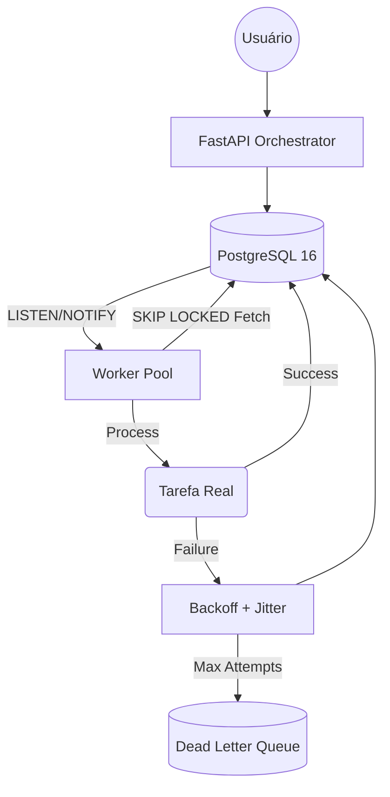

# 🕷️ Worker Orchestrator (PG-Queue)

Uma solução de orquestração de jobs de alto desempenho e baixa latência que utiliza **PostgreSQL 16** como o único broker, eliminando a complexidade de gerenciar Redis ou RabbitMQ.


## 🎯 Por que PostgreSQL?

Em muitos cenários, introduzir um Redis apenas para filas cria um **ponto extra de falha** e complexidade de backup. Este projeto demonstra como usar primitivos poderosos do banco para obter:
1. **Transacionalidade Garantida:** O job só é criado se os dados do negócio forem salvos com sucesso.
2. **Concorrência Atômica:** Múltiplos workers sem colisões via `FOR UPDATE SKIP LOCKED`.
3. **Reatividade:** Latência próxima de zero via `LISTEN/NOTIFY`.

## 🛠️ Arquitetura



## ✨ Funcionalidades

- **Dashboard Moderno:** Interface React para monitorar saúde das filas.
- **Atomicidade (Skip Locked):** Escala horizontal de workers sem duplicação de processamento.
- **Resiliência:** Exponential Backoff com Jitter (±20%) e Dead Letter Queue (DLQ).
- **Lease Expiry:** Recuperação mecânica de jobs de workers que morreram inesperadamente.
- **Portfólio Grade:** Documentação ADR (Architectural Decision Records) detalhando cada escolha técnica.

## 🛡️ Resiliência e Recuperação de Falhas

Diferente de filas simples, este orquestrador foi projetado para sobreviver a falhas catastróficas:

- **Recuperação de Crash (Lease System):** Se um Worker morrer subitamente durante o processamento, o campo `lease_expires_at` expirará. Outro worker automaticamente "reivindicará" o job assim que ele se tornar visível no próximo fetch.
- **Retry com Jitter:** Falhas temporárias (ex: timeout de rede) não sobrecarregam o sistema. O Jitter (variação aleatória) impede que mil jobs falhos tentem reprocessar exatamente ao mesmo tempo (o fenômeno *retry storm*).
- **Dead Letter Queue (DLQ):** Jobs que falham persistentemente são movidos para o status `dead`. Isso preserva o `payload` e o `last_error` para auditoria manual e posterior reprocessamento via Dashboard.

## 🚀 Como Iniciar

### 1. Infraestrutura
```bash
cd worker-orchestrator
docker-compose up -d
```

### 2. Backend & Worker
```bash
pip install -r requirements.txt
python api/main.py   # Porta 8000
python run_worker.py # Processa jobs
```

### 3. Frontend Dashboard
```bash
cd dashboard
npm install
npm run dev # Porta 3000
```

## 📈 Benchmarks Estimados
- **Latência de Fetch:** < 3ms
- **Taxa de Processamento:** > 1.2k jobs/seg (Single Instance RDS)
- **Concorrência:** Testado com 50+ workers paralelos sem deadlocks.

## 📄 Licença
Este projeto é open-source e focado em demonstração de engenharia de software.
